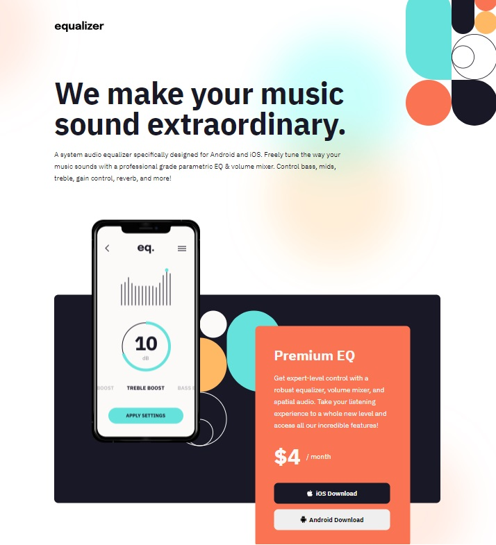

# Frontend Mentor - Equalizer landing page solution

https://krzysztofrozbicki.github.io/fem-challenge-2/

This is a solution to the
[Equalizer landing page challenge on Frontend Mentor](https://www.frontendmentor.io/challenges/equalizer-landing-page-7VJ4gp3DE).
Frontend Mentor challenges help you improve your coding skills by building realistic projects.

## Table of contents

- [Overview](#overview)
  - [The challenge](#the-challenge)
  - [Screenshot](#screenshot)
  - [Links](#links)
- [My process](#my-process)
  - [Built with](#built-with)
  - [What I learned](#what-i-learned)
  - [Continued development](#continued-development)
- [Author](#author)
- [Acknowledgments](#acknowledgments)

## Overview

### The challenge

Users should be able to:

- View the optimal layout depending on their device's screen size
- See hover states for interactive elements

### Screenshot

### Links

- Solution URL: https://github.com/KrzysztofRozbicki/fem-challenge-2/
- Live Site URL: https://krzysztofrozbicki.github.io/fem-challenge-2/

## My process

### Built with

- Semantic HTML5 markup
- CSS custom properties
- Flexbox
- CSS Grid
- Mobile-first workflow

### What I learned

- How to use and position the background - although it was quite difficult at the start.
- To use svg as an decoration elements and position them.
- Way of 3dimensional placing elements with z-index.
- That I cannot use @extend in scss with @media query. 

### Continued development

Want to learn how to make more responsive, than adaptive layouts with such strict positioning from the designer.

## Author

- GitHub - [GitHub](https://github.com/KrzysztofRozbicki)
- Website - [Pogbit](https://www.pogbit.com/)
- Frontend Mentor - [@KrzysztofRozbicki](https://www.frontendmentor.io/profile/KrzysztofRozbicki)

## Acknowledgments

It is quite hard to make it fully responsive, as a lot of subtle details and positioning are changing in adaptive way due to design. I would recommend using @mixin for typography, I should have done it :)
